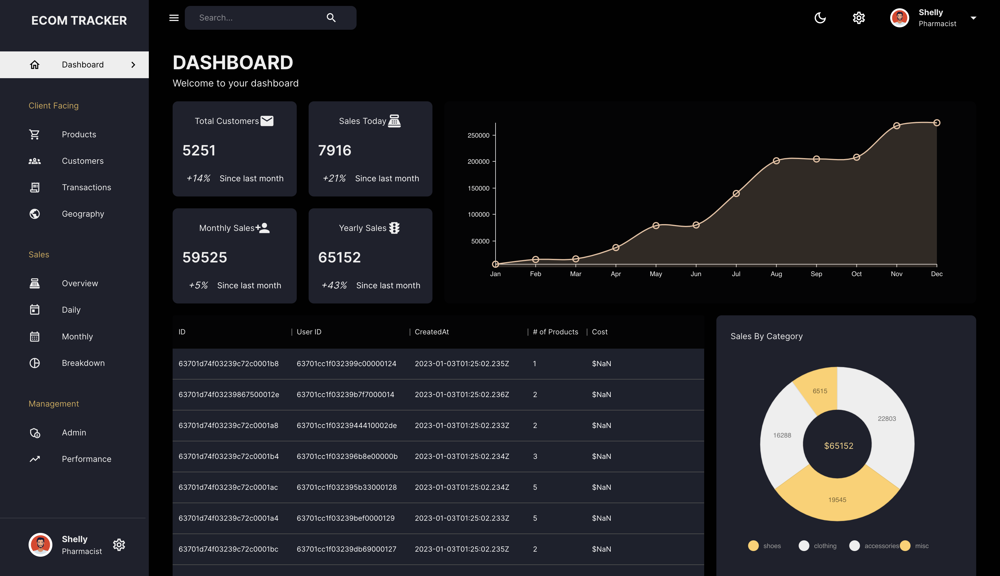
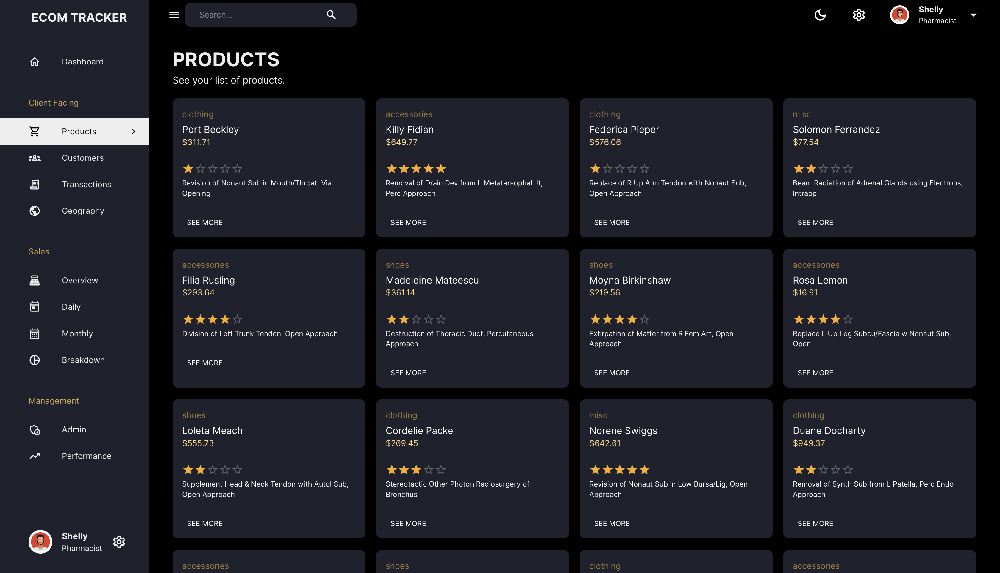

<!-- ABOUT THE PROJECT -->
## About The Project
Admin Page to track users and products also be able to see data
- Due to using a free version of deployment the api takes 3-5 mins to be successfully fetched
### Built With
- Material Ui
- React 
- MongoDB
- Render 

## Link
[Live Link](https://admin-tracker.onrender.com/dashboard)






### Prerequisites

This is an example of how to list things you need to use the software and how to install them.
* npm
```sh
npm install npm@latest -g
```

### Installation


<!-- USAGE EXAMPLES -->
## Usage

Use this space to show useful examples of how a project can be used. Additional screenshots, code examples and demos work well in this space. You may also link to more resources.

_For more examples, please refer to the [Documentation](https://example.com)_


<!-- ROADMAP -->
## Roadmap

See the [open issues](https://github.com/othneildrew/Best-README-Template/issues) for a list of proposed features (and known issues).


<!-- CONTRIBUTING -->
## Contributing

Contributions are what make the open source community such an amazing place to be learn, inspire, and create. Any contributions you make are **greatly appreciated**.

1. Git Clone
2. cd server npm install 
4. Enter MongoDB URL in env file
5. node index.js
6. cd.. cd client
7. npm install
8. npm run start


